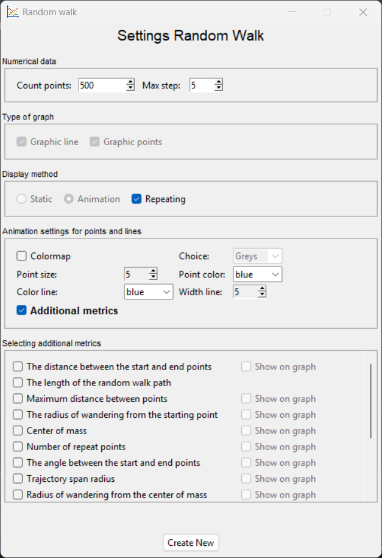
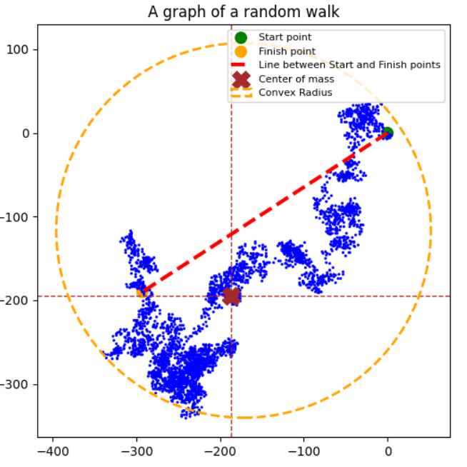
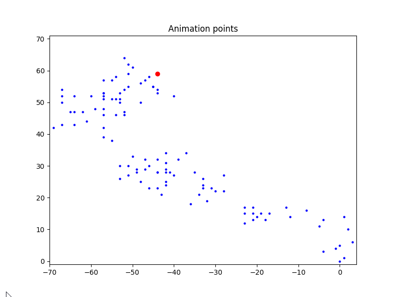
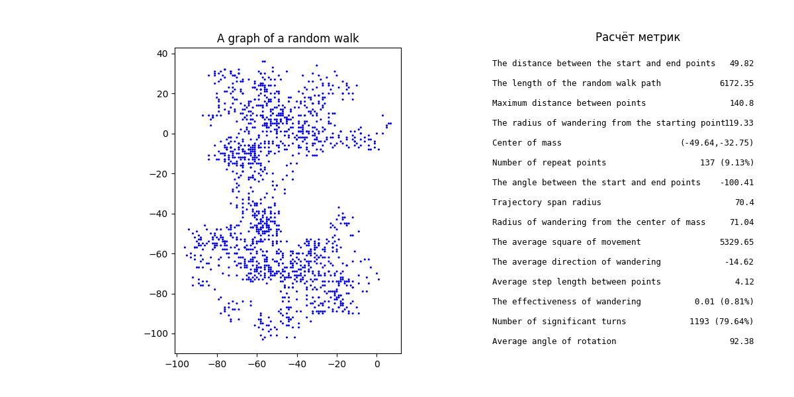
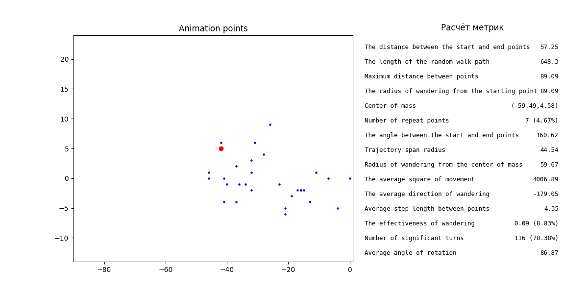

# Random Walk Visualizer
Random walk Visualizer is a program for generating and visually analyzing random walks. 
The program is based on assignment 15.1-15.5 from [book](https://disk.yandex.ru/i/ttWTX-bEfT5LrQ ) Eric Mathis
"Learning Python. Game programming, data visualization, web applications", but significantly expanded by me in terms of
functionality.

The goal of the program is to create an intuitive GUI on Tkinter with advanced possibilities for visualizing walking
through matplotlib, with a system of [metrics](#-metrics) and animation, as well as to develop practical skills in this area of the
Python programming language.

# ⚙️ Key Features
### 1. Intuitive graphical interface: :ok_hand:
This is a user-friendly settings window that allows users to set the parameters of the walk and its appearance without
having to manually edit the code.

<div align="center">

</div>

### 2. Flexible adjustment of the wandering diagram: :art:
 - Choosing the type of graph to display: *point, line, or combined*

<div align="center">


</div>

- Appearance settings: *color (including color maps), size of dots and line*
<div align="center">

</div>

- Display mode selection: *static* in the form of an image and *animation* visualizing the process of wandering
<div align="center">

</div>

### 3. A metric system that can be easily scaled: :heavy_plus_sign:
This is a tool that automatically calculates the characteristics of the current walk selected by the user.

<div align="center">

</div>

### 4. Visual representation of metrics:  :chart_with_upwards_trend:
Now it is possible to display some metrics directly on the graph, which allows for a more visual analysis.

<div align="center">

</div>

# 🚀 Installation
1. Clone the repository
```bash
git clone https://github.com/vitaly921/RandomWalk.git
```
2. Install the dependencies
```bash
pip install -r requirements.txt
```
3. Run the program
```bash
python rw_visual.py
```
# 🧩 How to Use 
After launching the program, the settings window opens. In this window, the user must fill in the frames with numerical
data, adjust the type of graphs, and optionally select additional metrics. Let's take a closer look at the algorithm of
the program and each frame, as well as show a diagram of possible graphs depending on the user's choice.

## The general algorithm of work :arrows_clockwise: 
<div align="left">

</div>

## Frames :framed_picture:
### Numerical data
Specify here the number of wandering points in the range from 1 to 5000 and the maximum allowed a step from 1 to 30.
### Type of graph
The user can choose the type of graph: point or linear. It is possible to choose both options.
### Display method
The user can choose only one method of display: static or animation. When you select an animation, you can adjust its
repetition (this is important for wandering with a small number of points).
### Customize the appearance for graph.
Let's consider the possibility for the user to select both linear and dotted graphs at the same time. This will allow
you to customize the appearance of the charts as flexibly as possible. In this case, the choice of parameters will not
depend on the display method.

| Type of graph | Parameters                                                |
|---------|-----------------------------------------------------------|
| Linear  |  |
| Points  |  |

### Selecting additional metrics
If desired, the user can mark the "Additional metrics" checkbox, which opens a special frame for selecting the 
indicators they are interested in. Some of them can be visualized on a graph, which greatly simplifies the analysis 
process.

    Note: This system is highly scalable: you can add new metrics to the program code and, if necessary, 
    create unique visualizations for each one.

## 🎯 Program Usage Scenarios
Depending on the settings, the results may be displayed in different ways. Below is a table with different data display
options:

| Display mode | Repeat | Metrics | Visual metrics|                                                          Results                                                           |
|-----------|:------:|:----:|:-------------------:|:--------------------------------------------------------------------------------------------------------------------------:|
| Static    |    🔒    |   ⌠  |          🔒           |                          |
| Animation |   ⌠   |   ⌠  |          🔒           |                       |
| Animation |   ✅    |   ⌠  |          🔒           |                    |
| Static    |    🔒    |    ✅ |          ⌠         |                    |
| Static    |    🔒    |    ✅ |          ✅          |             |
| Animation |   ⌠   |    ✅ |          ⌠         |                 |
| Animation |   ⌠   |    ✅ |          ✅          |          |
| Animation |   ✅    |    ✅ |          🔒           |       |

    Note: the results can be used for any type of graph.

# 📏 Metrics

| Metric                                             | Description                                            | Visible |                      Designation                                                              |
|----------------------------------------------------|--------------------------------------------------------|:---:|:---------------------------------------------------------------------------------------------:|
| **The distance between the start and end points**  | *Straight-line distance from initial to final position* |  ✅  |  |
| **The length of the random walk path**             | *Total trajectory length (sum of all steps)*           |  ❌  |                                              🔒                                               |
| **Maximum distance between points**                | *Largest gap between any two consecutive points*       |  ✅  |                |
| **The radius of wandering from the starting point** | *Maximum displacement from origin*                     |  ✅  |           |
| **Center of mass**                                 | *Average position of all points (centroid)*            |  ✅  |                   |
| **Number of repeat points**                        | *Count of revisited coordinates*                       |  ✅  |            |
| **The angle between the start and end points**     | *Direction from start to end point (degrees)*          |  ✅  |       |
| **Trajectory span radius**                         | *Radius of smallest circle containing entire path*     |  ✅  |              |
| **Radius of wandering from the center of mass**    | *Maximum distance from centroid*                       |  ✅  |            |
| **The average square of movement**                 | *Mean squared displacement from origin*                |  ❌  |                                              🔒                                               |
| **The average direction of wandering**             | *Mean angle of movement vectors*                       |  ✅  |           |
| **Average step length between points**             | *Mean distance between consecutive points*             |  ❌  |                                              🔒                                               |
| **The effectiveness of wandering**                 | *Net displacement divided by path length*              |  ❌  |                                              🔒                                               |
| **Number of significant turns**                    | *Count of direction changes above threshold*           |  ❌  |                                              🔒                                               |
| **Average angle of rotation**                      | *Mean change in direction between steps*               |  ❌  |                                              🔒                                               |

# 🛠️ Technologies Used
- **Python 3.6** is the main development language.
- **Tkinter**  is used to create a settings window.
- **Matplotlib** is used to create graphs.
- **NumPy** allows you to perform mathematical operations and work with arrays.
- **Random** is used to generate random steps.
- **Object-oriented programming** (OOP) is implemented through the creation of custom classes: MetricCheckBox and RandomWalk.

# 📝 License
This project is licensed under the MIT License - see the [LICENSE](LICENSE) file for details.

# 💬 Feedback
If you are already using this program and would like to share your impressions or make suggestions for improvement,
please create a new issue on GitHub or email the author at [prihodkov21vek@gmail.com]() .
