# Random walk Visualizer
Random walk Visualizer - программа для генерации и визуального анализа случайных блужданий. 
Программа написана на основе задания 15.1-15.5 из [book](https://disk.yandex.ru/i/ttWTX-bEfT5LrQ) Эрика Мэтиса «Изучение Python. Программирование игр,
визуализация данных, веб-приложения», но значительно расширена мной по функционалу.

Цель программы - создать интуитивный GUI на Tkinter с расширенными возможностями визуализации блкуждания через matplotlib,
с системой метрик и анимацией, а также развить практические навыки в этой области языка программирования Python.

# ⚙️ Key Features
### 1. Интуитивно понятный графический интерфейс: :ok_hand:
представляет собой удобное окно настроек для ввода пользователем параметров блуждания и его внешнего 
вида вместо ручного редактирования кода;

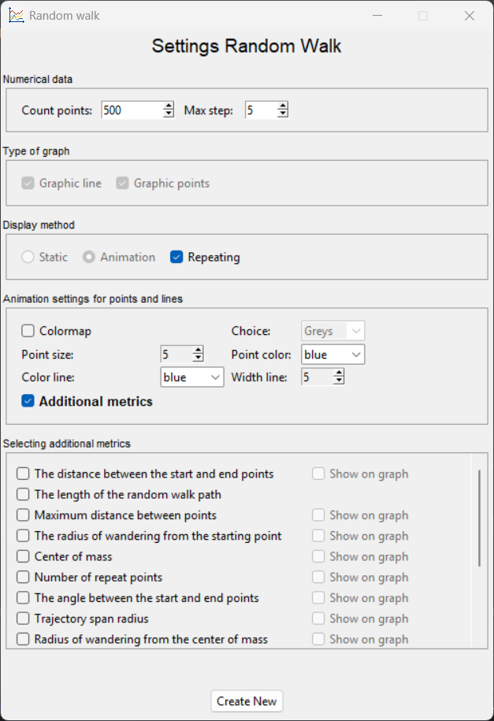

### 2. Гибкая настройка диаграммы: :art:
- Выбор типа отображения траектории: точечный, линейный, комбинированный график (скрины графиков)

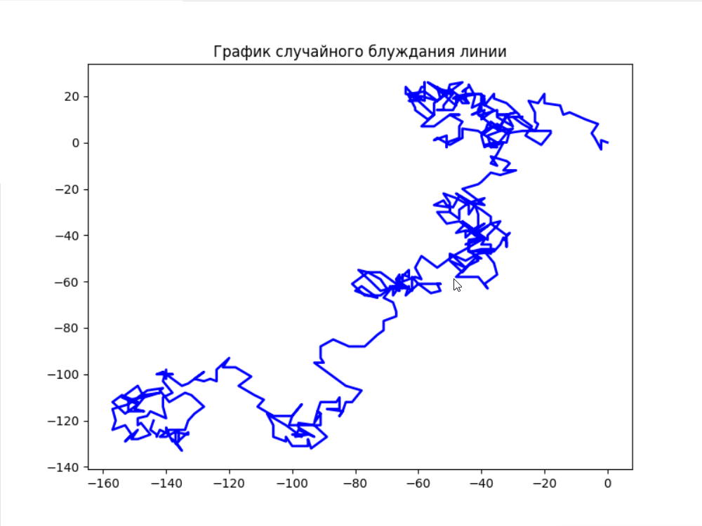
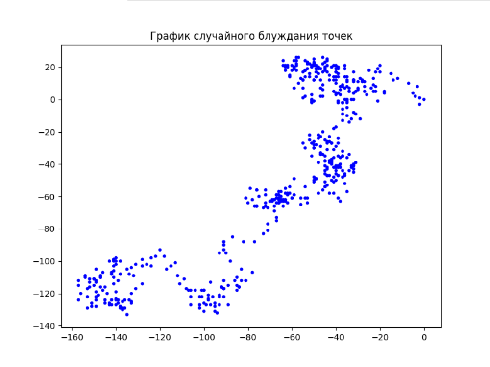

- Настройка внешнего вида: цвет (включая цветовые карты), размер точек/линии (скрин с цветовой картой)

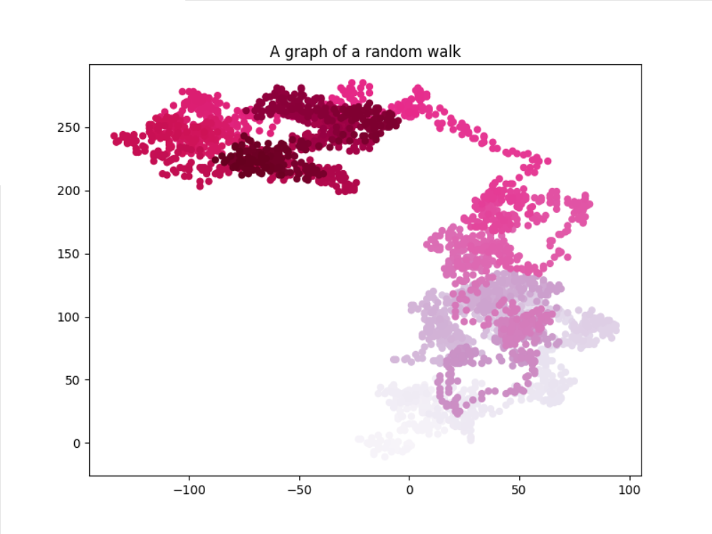

- Выбор режима отображения: статистический в виде изображения и анимация с визуализацией процесса блуждания (gif с анимацией)

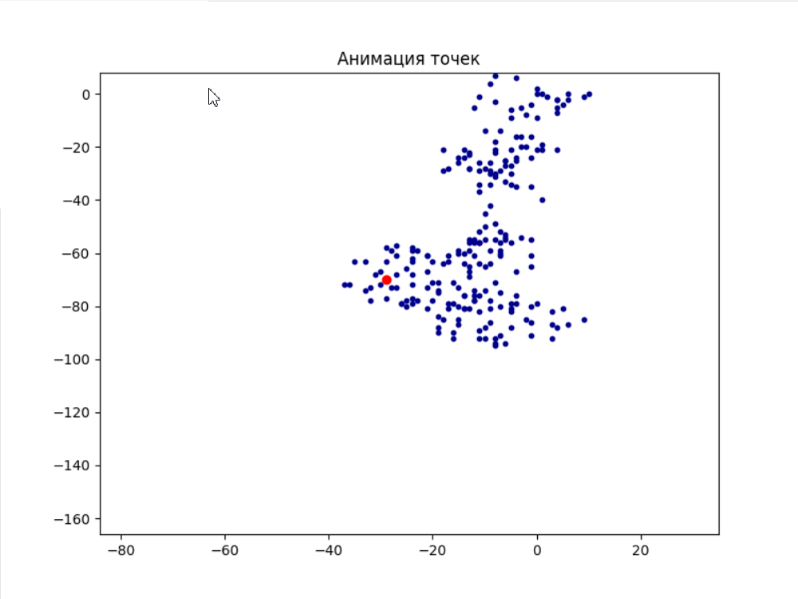

### 3. Масштабируемая система метрик: :heavy_plus_sign:
представляет собой автоматический расчёт выбранных пользователем характеристик блуждания. 

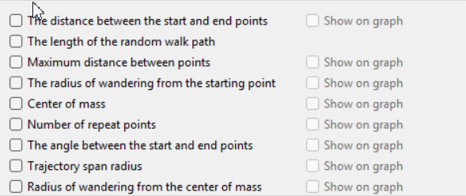

### 4. Визуальное представление метрик:  :chart_with_upwards_trend:
возможность показать некоторые метрики прямо на графике для наглядного анализа

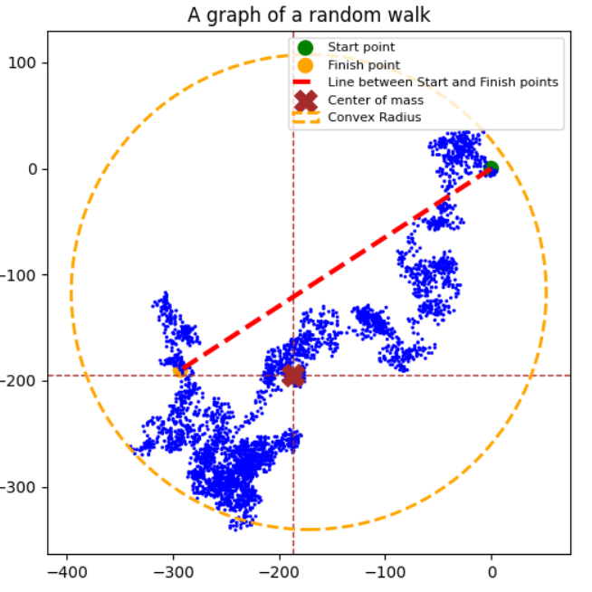

# 🚀 Installation
1. Клонируйте репозиторий
2. Установите зависимости
3. Запустите программу

# How to Use
После запуска программы в открывшемся окне настроек пользователь должен заполнить фреймы численными данными, настроить 
вид графиков, выбрать по желанию дополнительные метрики. Рассмотрим внимательнее каждый фрейм, а в конце покажем схему
возможных графиков для лучшего понимания.

## Общий алгоритм работы
1. **Запустите** программу Random walk;
2. **Заполните** численные данные;
3. **Настройте** внешний вид графика;
4. **Выберите** *по-желанию* дополнительные метрики;
5. **Нажмите** кнопку *Create new*;
6. **Анализируйте** результаты построения

Рассмотрим детальнее каждый фрейм окна настроек:
### Numerical data
Здесь необходимо указать количество точек блуждания (от 1 до 5000), а также максимально допустимый шаг (от 1 до 30)
### Type of graph
Пользователь выбирает тип графика: точечный или линейный. Возможно выбрать оба типа
### Display method
Пользователь может выбрать только один метод построения: статическое или анимация. Притом при выборе анимации
можно задать её повторение (актуально для блуждания с малым кол-вом точек)
### Настройка вида для выбранного типа графика
Рассмотрим вариант выбора пользователем линейного и точечного графиков одновременно. В таком случае будет максимально 
доступен выбор параметров внешнего вида. При том в данном случа он не зависит от метода отображения

| Тип графика | Параметры                                                                    |
|-------------|------------------------------------------------------------------------------|
| Linear      | 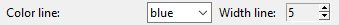                   |
| Points      | 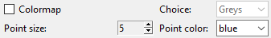 |

Для линейного графика доступны два элемента, которые можно изменить: цвет и ширина линии

Для точечного графика помимо выбора размера точек и их цвета добавлены цветовые карты для градиентного изменения цветов

### Selecting additional metrics
При желании пользователь может отметить чек-бокc Additional metrics после чего откроется соответствующий фрейм, где
выбираются желаемые метрики. Для некоторых из них добавлена возможность визуального отображения на графике, что делает 
его еще более полезным для анализа. 
    
    Важно! Этот фрейм легко масштабирутся: при желании в коде программы добавлять новые метрики с возможностью уникальной визуализации при необходимости.
## 🎯 Сценарии использования программы
В зависимости от выбора настроек результат отображения может быть разным. Ниже в таблице указаны различные 
сценарии отображения результатов:

| Режим отображения | Повтор | Метрики | Визуализация метрик |                                                        Результат                                                        |
|-------------------|:------:|:----:|:-------------------:|:-----------------------------------------------------------------------------------------------------------------------:|
| статика           |    🔒    |   ❌   |          🔒           |           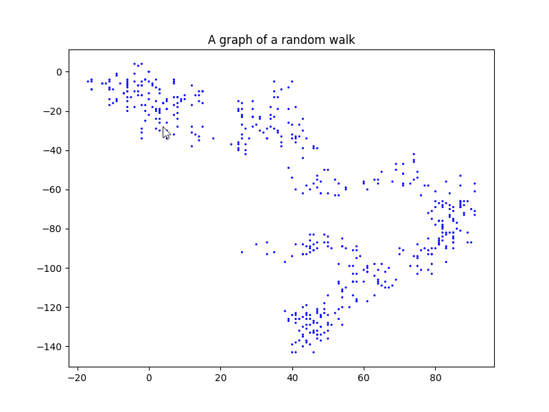            |
| анимация          |   ❌    |   ❌   |          🔒           |          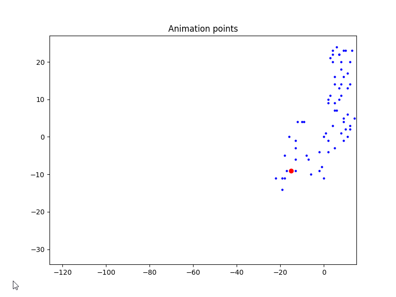          |
| анимация          |   ✅    |   ❌   |          🔒           |        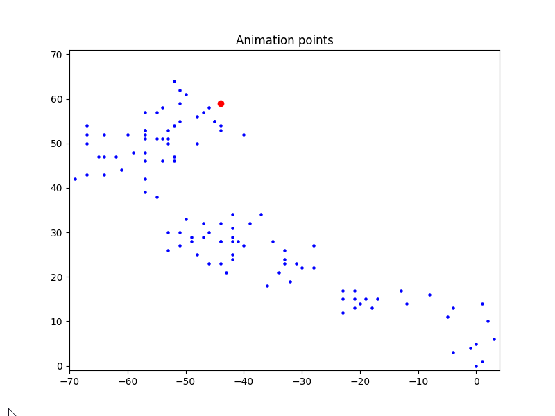         |
| статика           |    🔒    |    ✅ |          ❌          |        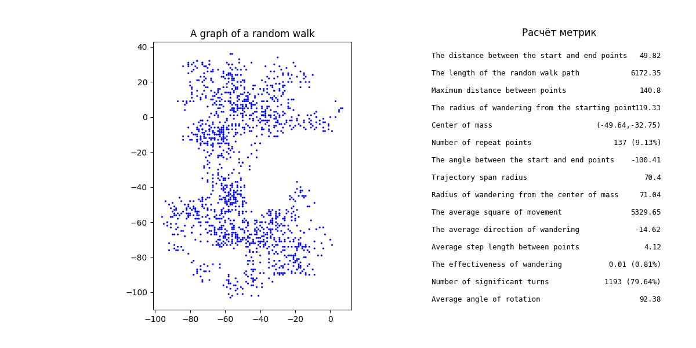         |
| статика           |    🔒    |    ✅ |          ✅          |          |
| анимация          |   ❌    |    ✅ |          ❌          |       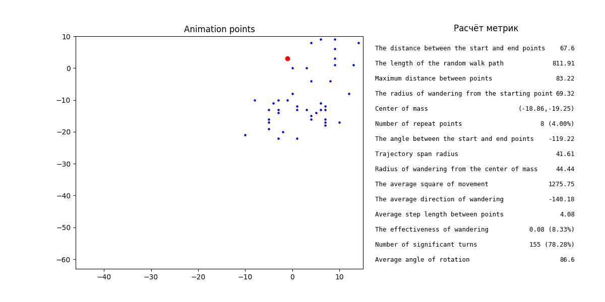       |
| анимация          |   ❌    |    ✅ |          ✅          |       |
| анимация          |   ✅    |    ✅ |          🔒           |  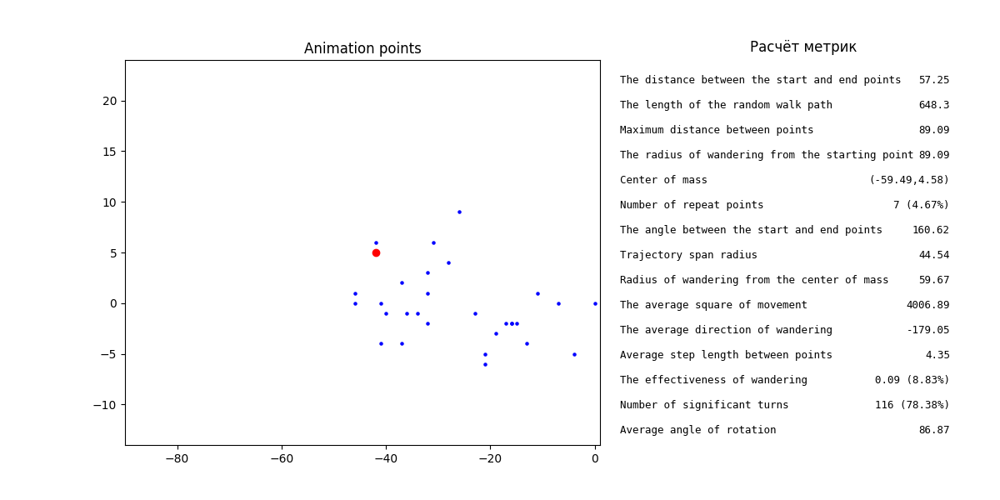  |

    Важно! Результаты применимы для любого типа графика

# 📏 Metrics
Добавить краткое описание каждой метрики (возможно в таблице со скринами и обозначениями линий на графике)
В конце отметить что метрики можно добавлять то есть масштабирование

| Метрика                                       | Описание                                               |  Визуализация  |                                          Обозначение                                          |
|-----------------------------------------------|--------------------------------------------------------|:--------------:|:---------------------------------------------------------------------------------------------:|
| **The distance between the start and end points** | *Straight-line distance from initial to final position* |       ✅        | 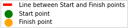 |
| **The length of the random walk path**        | *Total trajectory length (sum of all steps)*           |       ❌        |                                              🔒                                               |
| **Maximum distance between points**           | *Largest gap between any two consecutive points*       |       ✅        |        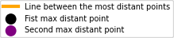        |
| **The radius of wandering from the starting point** | *Maximum displacement from origin*                     |       ✅        |     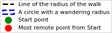      |
| **Center of mass**                            | *Average position of all points (centroid)*            |       ✅        |                   |
| **Number of repeat points**                   | *Count of revisited coordinates*                       |       ✅        |            |
| **The angle between the start and end points** | *Direction from start to end point (degrees)*          |       ✅        |       |
| **Trajectory span radius**                    | *Radius of smallest circle containing entire path*     |       ✅        |              |
| **Radius of wandering from the center of mass** | *Maximum distance from centroid*                       |       ✅        |            |
| **The average square of movement**            | *Mean squared displacement from origin*                |       ❌        |                                              🔒                                               |
| **The average direction of wandering**        | *Mean angle of movement vectors*                       |       ✅        |     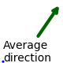      |
| **Average step length between points**        | *Mean distance between consecutive points*             |       ❌        |                                              🔒                                               |
| **The effectiveness of wandering**            | *Net displacement divided by path length*              |       ❌        |                                              🔒                                               |
| **Number of significant turns**               | *Count of direction changes above threshold*           |       ❌        |                                              🔒                                               |
| **Average angle of rotation**                 | *Mean change in direction between steps*               |       ❌        |                                              🔒                                               |

# 🛠️ Используемые технологии

# Отзывы

